# Neural_Network_Charity_Analysis

## Overview of the analysis
The purpose of this analysis was to use deep learning models to vet donation applicants for AlphabetSoup, a philanthropic organization dedicated to donating funds to other organizations. The deep learning models would aid AlphabetSoup in their decision to donate by predicting if an organization would be successful if they were given funding. The dataset includes more than 34,000 organizations that have received funding from AlphabetSoup over the years.

## Results

Data Preprocessing
- We inspected the data and dropped two columns that were not needed, "EIN" and "NAME". These neither targets nor features.

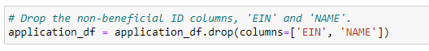

- The variable considered as the target for the model is the IS_SUCCESSFUL column.
- The variable(s) considered to be the features for the model are:

    APPLICATION_TYPE—Alphabet Soup application type  
    AFFILIATION—Affiliated sector of industry  
    CLASSIFICATION—Government organization classification  
    USE_CASE—Use case for funding  
    ORGANIZATION—Organization type  
    STATUS—Active status  
    INCOME_AMT—Income classification  
    SPECIAL_CONSIDERATIONS—Special consideration for application  
    ASK_AMT—Funding amount requested

- We inspected the number of unique values and identified columns that had more than 10 unique values. We would need bucketing to reduce the number of dummy columns. This would be indicated by the "other" column.

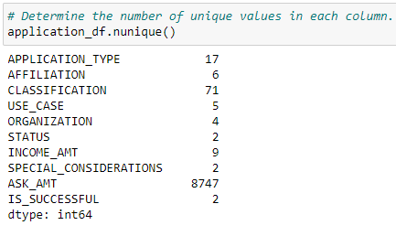

- We looked at the APPLICATION_TYPE value counts for binning and generated a density plot.

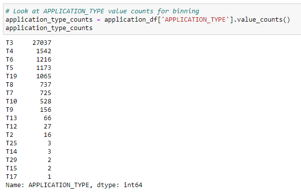

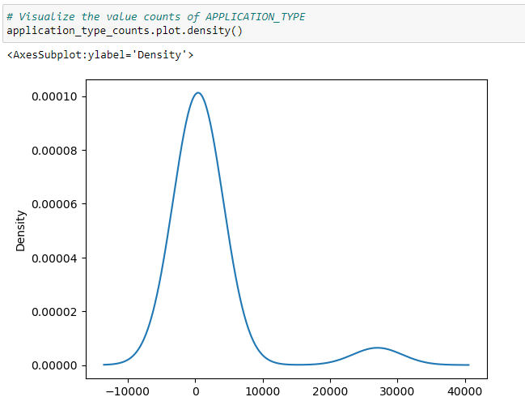

- To further reduce the unique values, we filtered the list of value counts that occured less than 500 times in the column. We used the replace method to replace all of those values with "other". The same procedure was used for the CLASSIFICATION column.

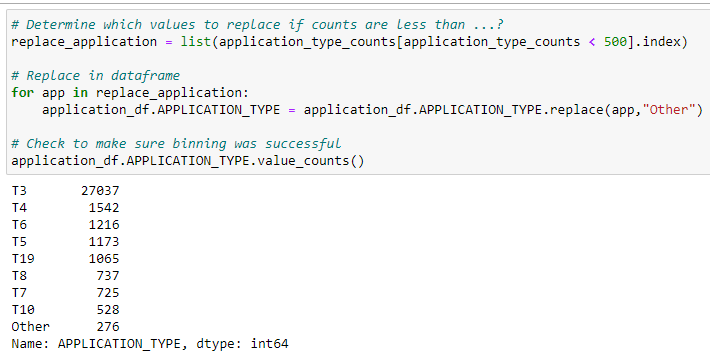

- We generated categorical variables

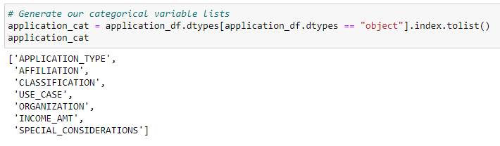

- We encoded the categorical variables using one-hot encoding, placed the variables in a new DataFrame and finally merged the one-hot encoding DataFrame with the original DataFrame.

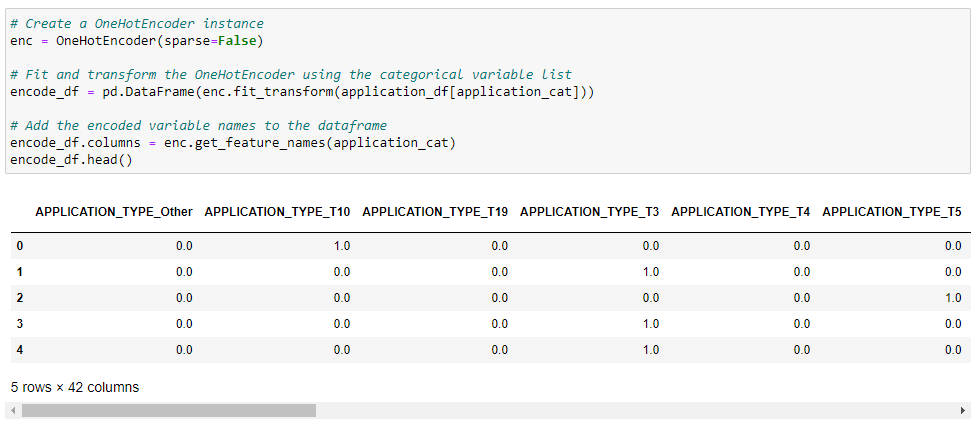

- We split the dataset between "y" target and "X" features and split the preprocessed data into a training and testing dataset. 

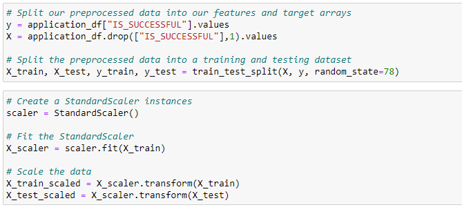

Compiling, Training, and Evaluating the Model
- The first hidden layer has 80 neurons, the second has 30. The activation function of hidden layers was "relu" and the output layer is "sigmoid". 

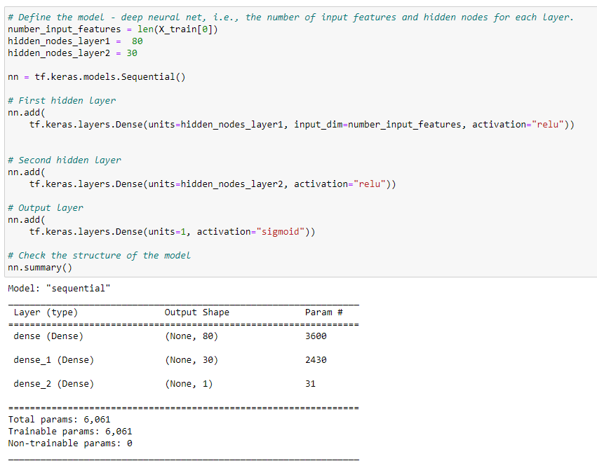

- I was not able to achieve the target for the model of 75% accuracy. Instead my accuracy was 52%.

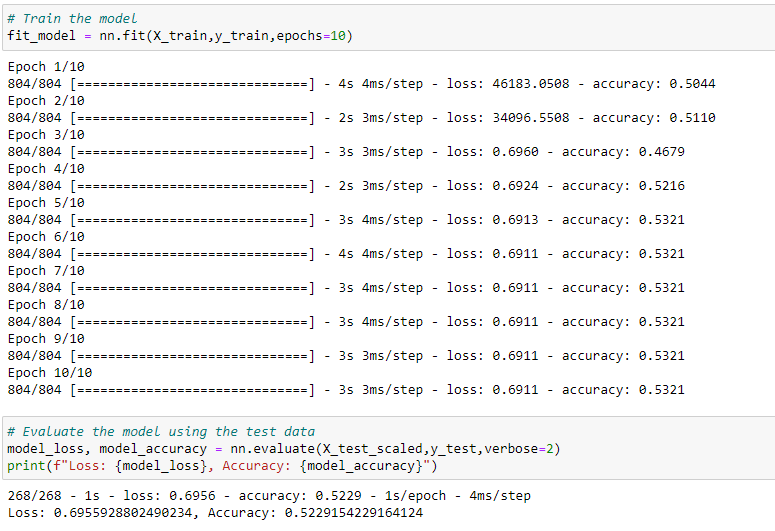

- To increase model performance, I added hidden layers, changed the activation function from "relu" to "tanh" and also increased the number of epochs but realized this did not make a huge difference. I therefore went back to using 100 epochs. Unfortunately, even with these changes I was not able to reach or surpass the target of 75% accuracy. 

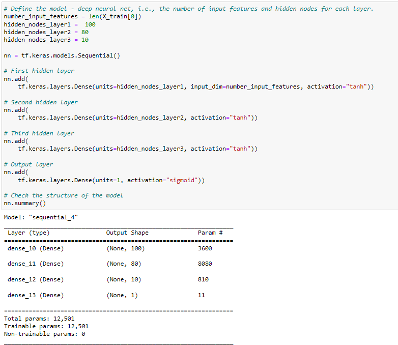

## Summary
The accuracy fell short of 75%, at 72%. One consideration and approach would be to get more data to improve the accuracy and be better able to predict if the organization would be succcessful if funded by AlphabetSoup.