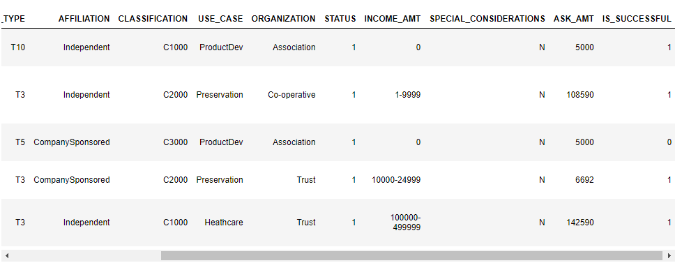

# Neural_Network_Charity_Analysis

## Overview of the analysis
The purpose of this analysis was to use deep learning models to vet donation applicants for AlphabetSoup, a philanthropic organization dedicated to donating funds to other organizations. The deep learning models would aid AlphabetSoup in their decision to donate by predicting if an organization would be successful if they were given funding. The dataset includes more than 34,000 organizations that have received funding from AlphabetSoup over the years.

## Results

Data Preprocessing
- The variable(s) considered the target(s) for the model is the IS_SUCCESSFUL column.
- The variable(s) considered to be the features for your model are:

    APPLICATION_TYPE—Alphabet Soup application type  
    AFFILIATION—Affiliated sector of industry  
    CLASSIFICATION—Government organization classification  
    USE_CASE—Use case for funding  
    ORGANIZATION—Organization type  
    STATUS—Active status  
    INCOME_AMT—Income classification  
    SPECIAL_CONSIDERATIONS—Special consideration for application  
    ASK_AMT—Funding amount requested

- The variable(s) that are neither targets nor features, and should be removed from the input data are 'EIN' & 'NAME

Compiling, Training, and Evaluating the Model
- How many neurons, layers, and activation functions did you select for your neural network model, and why?
- Were you able to achieve the target model performance?
- What steps did you take to try and increase model performance?

## Summary
